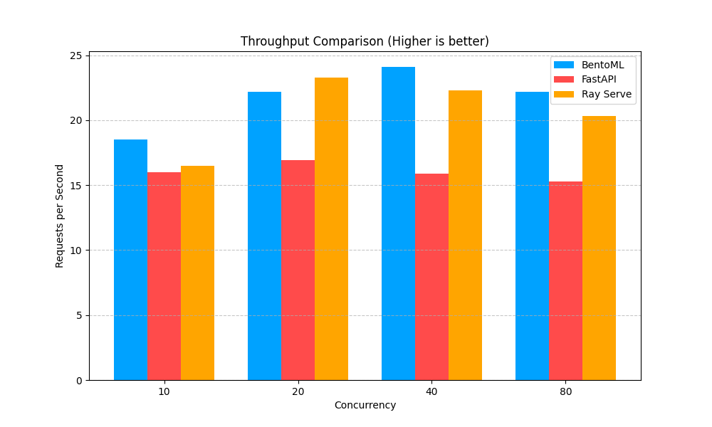
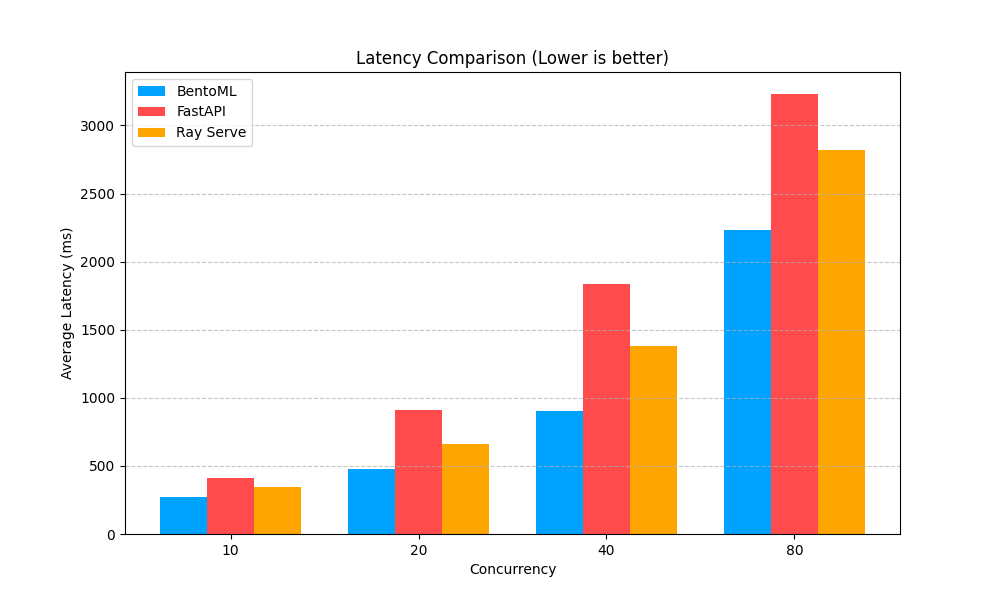

# 📊 Benchmark Results: BentoML vs FastAPI vs Ray Serve

**Run Date:** 2026-01-19 17:30:09
- **Duration per level:** s
- **Concurrency levels:** 

## 🏆 Executive Summary

## 📊 Visual Comparison

- **Latency King:** BentoML (won 4/4 levels)
- **Throughput King:** BentoML (won 2/4 levels)

## 📈 Throughput Comparison (req/s)
| Concurrency | BentoML | FastAPI | Ray Serve | Winner |
| :--- | :--- | :--- | :--- | :--- |
| 10 | 19.80 | 16.50 | 20.00 | **Ray Serve** |
| 20 | 17.40 | 17.50 | 20.70 | **Ray Serve** |
| 40 | 22.60 | 16.10 | 18.90 | **BentoML** |
| 80 | 23.40 | 16.70 | 17.10 | **BentoML** |

## ⏱️ Latency Comparison (Average ms)
| Concurrency | BentoML | FastAPI | Ray Serve | Winner |
| :--- | :--- | :--- | :--- | :--- |
| 10 | 280.65 | 405.51 | 303.11 | **BentoML** |
| 20 | 592.57 | 913.49 | 665.54 | **BentoML** |
| 40 | 875.66 | 1978.24 | 1426.84 | **BentoML** |
| 80 | 1880.65 | 3415.23 | 3172.46 | **BentoML** |

## 🎯 P95 Latency Comparison (ms)
| Concurrency | BentoML | FastAPI | Ray Serve | Winner |
| :--- | :--- | :--- | :--- | :--- |
| 10 | 471.39 | 647.57 | 442.04 | **Ray Serve** |
| 20 | 1062.19 | 1017.35 | 937.61 | **Ray Serve** |
| 40 | 1406.76 | 2505.43 | 1954.30 | **BentoML** |
| 80 | 3123.61 | 4398.92 | 4793.71 | **BentoML** |

---
*Generated by Automated Benchmark Suite*