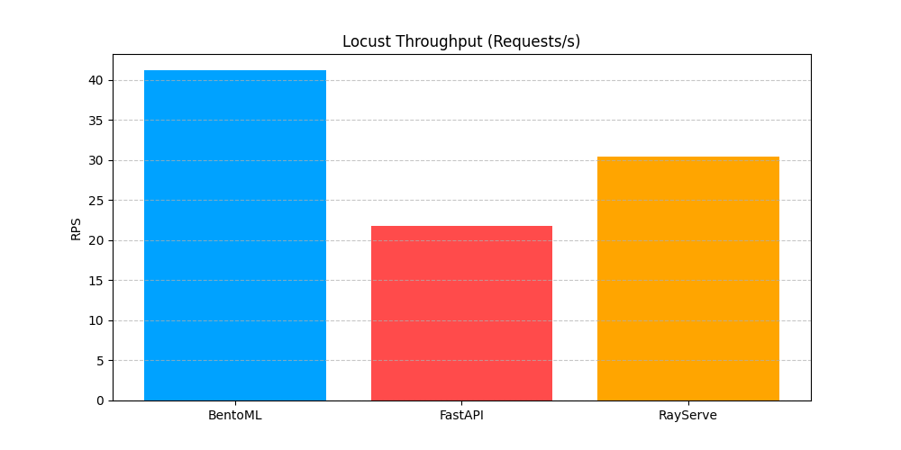
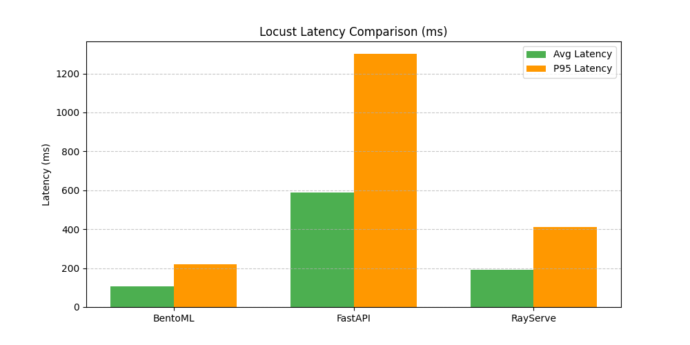

# 📈 Locust Load Test Comparison

**Run Date:** 2026-01-20 11:11:08

## 📊 Visual Comparison

## 📊 Aggregated Metrics

| Metric | BentoML | FastAPI | Ray Serve | Winner |
| :--- | :--- | :--- | :--- | :--- |
| Throughput (req/s) | 41.17 | 21.83 | 30.41 | **BentoML** |
| Avg Latency (ms) | 345.60 | 922.35 | 574.56 | **BentoML** |
| P50 Latency (ms) | 370.00 | 1000.00 | 660.00 | **BentoML** |
| P95 Latency (ms) | 570.00 | 1600.00 | 940.00 | **BentoML** |
| P99 Latency (ms) | 620.00 | 2800.00 | 1100.00 | **BentoML** |
| Total Requests | 1192.00 | 635.00 | 884.00 | **BentoML** |

## 📋 Detailed Results per Service

### BentoML
- **Requests:** 1192 (0 failures)
- **RPS:** 41.17
- **Latency:** Avg: 345.60ms | P95: 570.00ms | P99: 620.00ms | Max: 655.07ms

### FastAPI
- **Requests:** 635 (0 failures)
- **RPS:** 21.83
- **Latency:** Avg: 922.35ms | P95: 1600.00ms | P99: 2800.00ms | Max: 5698.21ms

### RayServe
- **Requests:** 884 (0 failures)
- **RPS:** 30.41
- **Latency:** Avg: 574.56ms | P95: 940.00ms | P99: 1100.00ms | Max: 1103.65ms